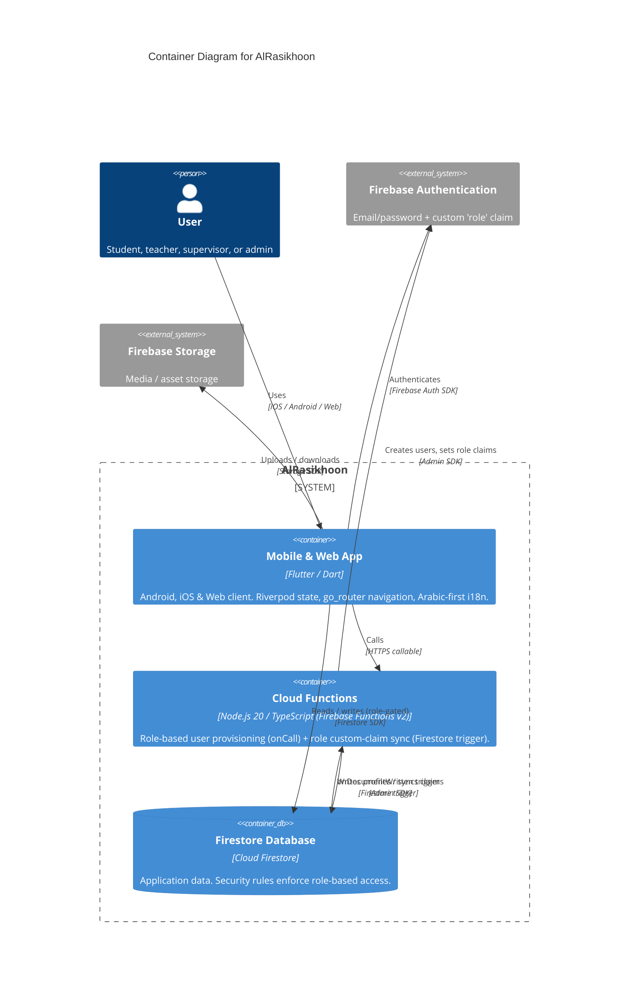

# Container Diagram — AlRasikhoon

> **C4 Level 2** — the system broken down into deployable/runnable containers. Audience: the dev team.

## Diagram

> **Note**: this diagram was auto-generated by /handover on 2026-05-17 from repo signals (pubspec.yaml, firebase.json, functions/package.json, functions/src/index.ts, firestore.rules). It is a **starting point** — review and refine.
>
> - Container labels and tech strings — the detector may have picked a framework version wrong
> - Inferred relationships — `user → app` assumes the standard Firebase client SDKs; adjust if your stack uses something else
> - External systems — anything used that isn't in pubspec.yaml / package.json (e.g. Firebase Hosting serving `build/web`, App Check, analytics) won't have been detected
>
> Update the "Maintenance" section below once the diagram is stable.

## Maintenance

(From the template — update when L2 containers change.)
